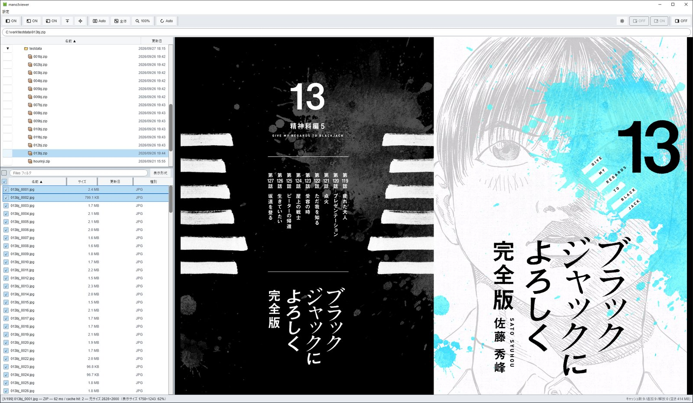
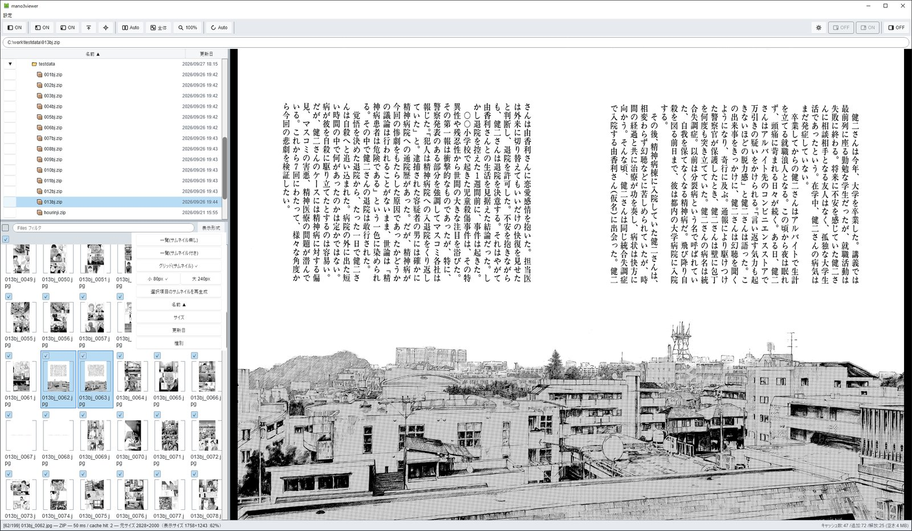
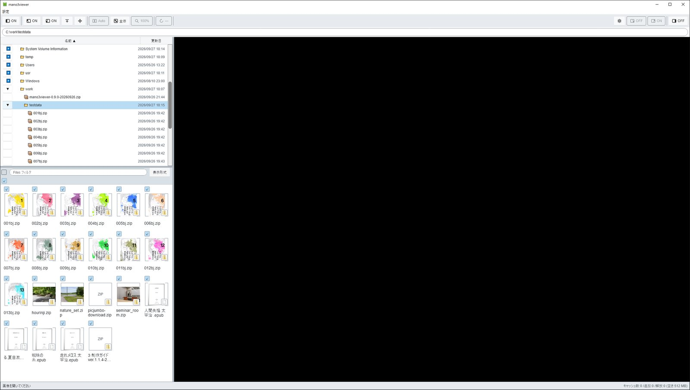
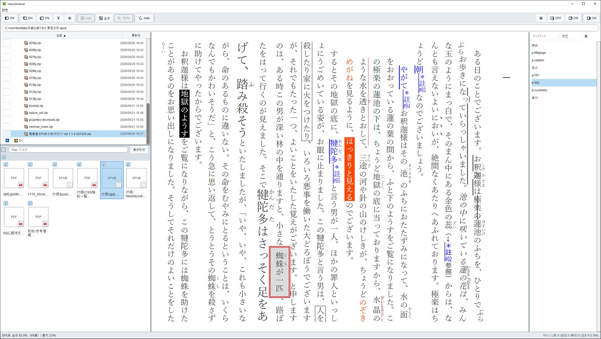
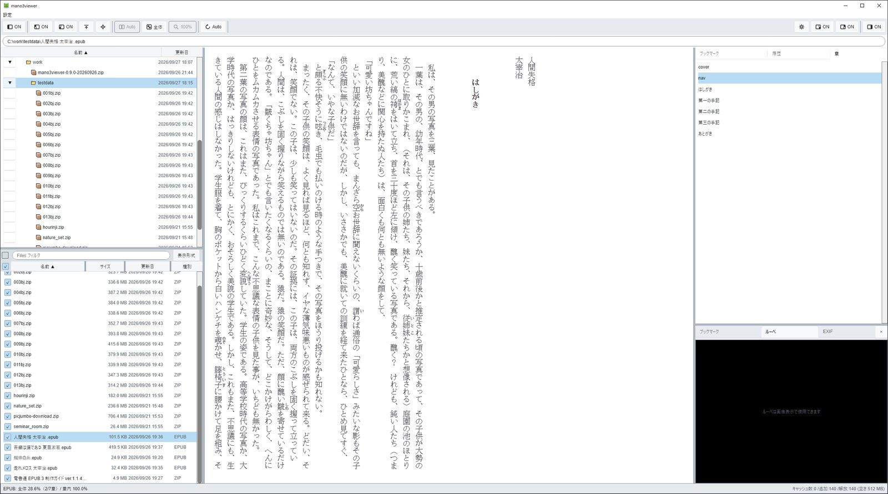
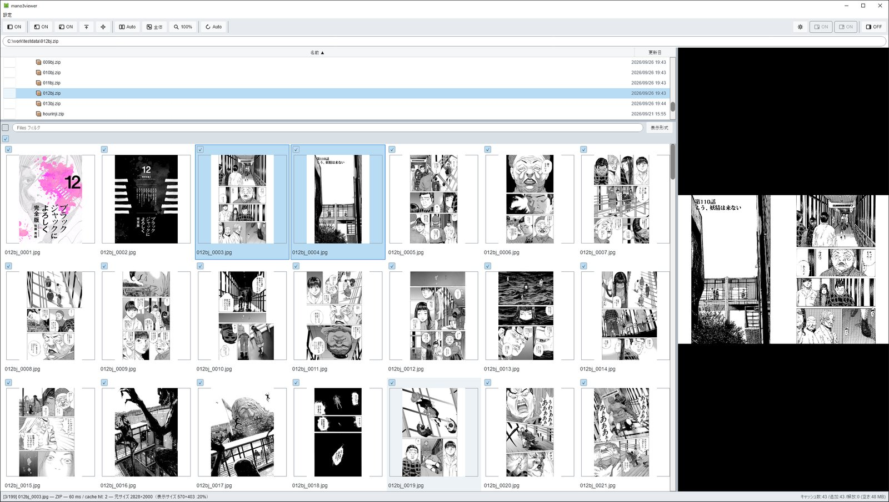
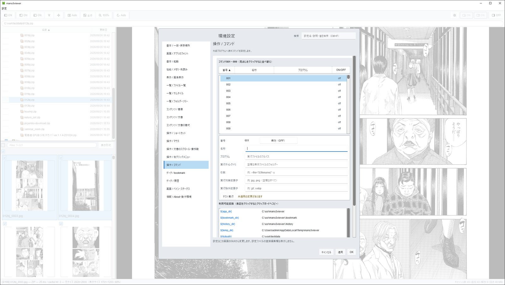
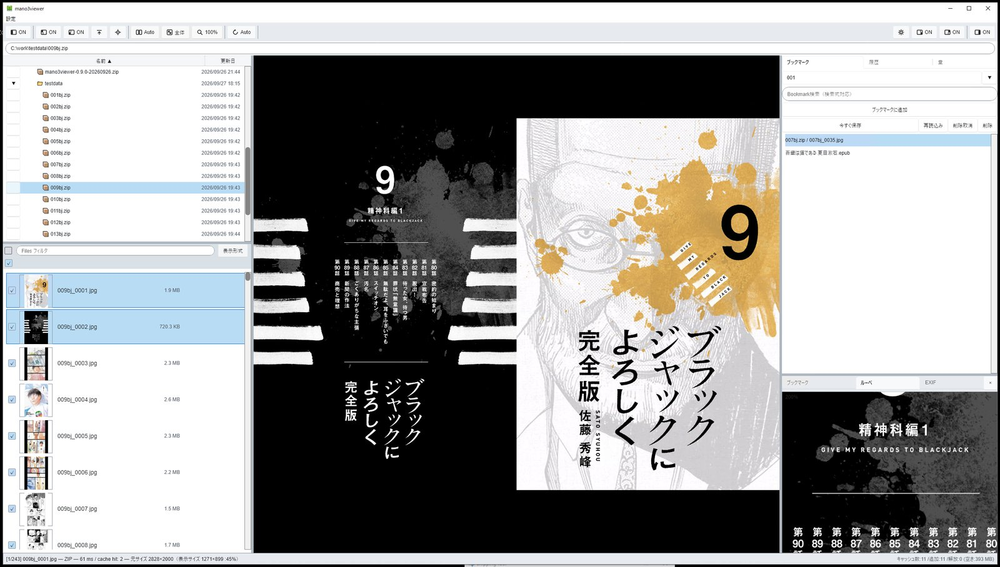

# mano3viewer

**フォルダツリー操作で漫画や小説のファイルを選択し、そのまま読む。3ペインタイプのWindows用ビューア。**

mano3viewerは、**Ma**nga（漫画・画像）と**No**vel（小説・電子書籍）を**3**ペイン風UIで楽しむためのビューアです。フォルダーツリー・ファイル一覧・閲覧画面を1つのウィンドウに並べ、たくさんのファイルの中から目的の一冊や一枚を探して、そのまま読み進められます。

- **本のように読める**：自炊した漫画などを見開きで表示できます。右綴じ・左綴じも切り替えられます。EPUBの小説は縦書き表示で読めます。（Markdownやtxtファイルも手動で縦書き表示切替可能）
- **中身を見ながら選べる**：画像や書庫はサムネイルで内容を確かめてから開けます。
- **NASでも軽快**：次の画像を先読みするので、NASなどネットワーク上に置いたファイルでも快適にページをめくれます。
- **書庫を展開せずに読める**：ZIP・CBZはそのまま開けます。7-Zipの `7z.dll` を用意すれば、RAR・7zなども読めます。書庫の中のEPUB・PDFや、書庫の中の書庫も開けます（サムネイル表示やBookmark登録ができないなどの制限があります）。
- **いろいろな形式に対応**：アニメーションGIF・WebPを再生できます。Windowsの画像拡張機能があれば、HEIC・HEIF・AVIFも表示できます。PDF・Markdown・テキストも読めます。Markdownの図（Mermaid）や数式も表示できます。
- **続きから読める**：Bookmarkと履歴から、読みかけの本へすぐ戻れます。

## 対応形式

| 種類 | 拡張子 | 必要なもの |
|---|---|---|
| 画像 | .png .jpg .jpeg .gif .bmp .tif .tiff .webp .ico .jxr .wdp .hdp .dds | なし |
| 画像（Windowsの拡張機能を使う形式） | .heic .heif .hif .avif .dng | 形式に対応するWindowsの画像拡張機能。環境によって開けない場合があります |
| 書庫 | .zip .cbz | なし |
| 書庫 | .7z .rar .tar .tgz .lzh .lha .iso .cab | 7-Zipの7z.dll |
| 電子書籍・文書 | .epub .pdf .md .markdown | WebView2 Runtime。Markdownは文字コードUTF-8のみ対応 |
| テキスト | .txt .ini .json .xml .toml .html .css .rs .js .ts .py .yaml .yml | WebView2 Runtime。文字コードはUTF-8のみ対応（Shift_JIS・UTF-16は開けません）。HTMLもテキストとして表示します |

追加ソフトの入手方法は、次の「初めて起動する前に」を参照してください。

## 初めて起動する前に

**動作環境：Windows 10／11（64bit版）**

ZIPを**書込み可能なフォルダーへ展開**し、`mano3viewer.exe` を起動してください。ZIPの中から直接起動しないでください。既定ではexeと同じ場所へ設定等を保存するため、Program Filesなどの書込みが制限された場所は避けてください。

**Microsoft Visual C++ Runtime（x64）が必要です。** DLLやインストーラーは同梱していません。

1. [Microsoft公式案内](https://learn.microsoft.com/ja-jp/cpp/windows/latest-supported-vc-redist)から最新のX64版をダウンロードします（[x64インストーラー](https://aka.ms/vc14/vc_redist.x64.exe)）。
2. `vc_redist.x64.exe` を実行してインストールします。管理者の許可が求められる場合があります。
3. 再起動を求められたらWindowsを再起動し、その後アプリを起動します。

必要な版以上のx64 Runtimeが導入済みなら再インストールは不要です。x86版だけでは代用できません。

用途によって、次の追加ソフトが必要です。これらも同梱していません。

| 読むもの | 必要なもの |
|---|---|
| PDF、EPUB本文、Markdown、テキスト | [Microsoft Edge WebView2 Runtime](https://developer.microsoft.com/microsoft-edge/webview2/)。画像主体のEPUBは不要な場合があります |
| RAR・7zなど | [7-Zip](https://www.7-zip.org/)のx64版に含まれる7z.dll。設定画面で場所を指定できます。DLL更新後はアプリを再起動してください。一時的に読み込めない場合は、1分ほど待って開き直してください |
| HEIC・HEIF・AVIF | Windowsの画像読込み機能（WIC）を利用します。Microsoft Storeなどから、その形式に対応する画像拡張機能・コーデックがインストールされている必要があります。環境によって開けない場合があります |

## 基本操作

ファイルやフォルダーは、次のいずれかの方法で開きます。

- **選択画面から開く**：Ctrl+O、または右クリックメニューの「ファイルを開く」「フォルダーを開く」で、Windows標準の選択画面が開きます。
- **ドラッグ＆ドロップ**：ファイルやフォルダーを画面へドロップします。Windowsショートカット（.lnk）をドロップすると、リンク先を開きます。
- **パス欄に入力**：上部のパス欄にフルパスを入力してEnterを押します。

| 操作 | 初期操作 |
|---|---|
| ファイルを開く | Ctrl+O |
| 次／前の画像 | ←／→（初期は右綴じ）、またはホイール下／上 |
| 拡大／縮小 | +／− |
| 画面内に収める／原寸 | Z／C |
| Bookmarkへ追加 | Ctrl+D |
| 左ペインを表示・非表示 | F9 |
| 右ペインを表示・非表示 | F12 |
| 10%刻みの位置へ移動 | 数字キー0～9（0＝先頭、1＝10%、…、9＝90%） |
| 没入全画面の切替 | F11、または画像のダブルクリック |

EPUB・Markdown（.md）では、右ペインの「章」タブで章・見出しの一覧を表示できます。右ペインが隠れている場合はF12で表示してください。一覧の項目を選ぶと、その章・見出しへ移動できます。

数字キーの割合移動は、画像表示やEPUB・Markdown・テキスト本文で利用できます。文字入力中は入力操作が優先されます。

EPUBの割合移動は、各章の表示ページ数を基準にします。初回は概算の位置へ移動し、計測が終わった後の操作から計測済みの値を使います。概算には誤差があり、計測完了時に現在位置を移動し直すことはありません。

Bookmark一覧では「サムネイルなし／小／大」を選べます。選択状態は保存され、次回起動時にも復元されます。登録時にFiles側のキャッシュ画像へのリンクを保存し、EPUB・書庫はファイル全体の表紙・代表画像を表示します。Bookmark一覧を開くだけでは画像を生成しません。元ファイルやDPIの変更後は再登録でリンクを更新してください。

Filesの「表示形式」の右にある親移動ボタンで、一つ上の場所へ戻れます。入れ子の書庫では一段ずつ外側へ戻ります。移動先に画像があれば先頭の画像を開きます。

EPUB・Markdown・テキストの連続表示では、ページ送り時に前の画面の行を0〜5行残す方式を選べます。設定画面の「コンテンツ / 文書形式」にあるEPUB本文・Markdown本文で変更してください。Markdownの設定はテキストにも適用されます。

画像の拡大・縮小方式とフィット時の拡大上限は、環境設定の「画像表示」で選べます。フィットの拡大上限は初期2倍（設定範囲1〜8倍）、固定倍率は最大32倍です。拡大を禁止している場合は1倍以下になります。詳しくは [初期設定と操作一覧](doc/default-setting.md) を参照してください。

文書本文やPDFでは画像と操作が異なります。詳しくは [初期設定と操作一覧](doc/default-setting.md) を参照してください。設定は画像表示面・左右のペイン・文書本文の右クリックメニューにある「環境設定を開く」から開きます。

## コマンドラインから起動する

PowerShellで、設定TOMLを指定して起動できます。指定したファイルは設定の読込み・保存の両方に使います。

```powershell
.\mano3viewer.exe --config "D:\設定\viewer.toml"
.\mano3viewer.exe --config "D:\設定\viewer.toml" "D:\本\sample.cbz"
.\mano3viewer.exe --help
```

`--help`（`-h`）で、保存先や開始位置などのオプション説明を表示します。ターミナルがない場合はダイアログで表示します。設定の指定を省略すると、通常はexe隣の `mano3viewer.toml` を使います。

## 更新・アンインストール

更新前にアプリを終了し、設定・Bookmark・履歴をバックアップしてください。新しい版の実行ファイルと同梱文書を置き換えます。保存先を変更しても既存データは自動移動しません。

アンインストールは、終了後に展開フォルダーを削除します。既定の設定ファイルはexe隣の `mano3viewer.toml`、Bookmark・履歴もexe隣に保存します。別に指定した保存先にはデータが残ります。

サムネイルは通常exe隣の `thumbnail-cache` に保存します。書き込めない場合などはWindowsの一時領域へ退避し、**終了しても残ります**。削除前に設定画面「一覧 / サムネイル」の保存先を確認してください。不要なら画面のキャッシュ削除機能を使用できます。実行前の確認があり、実行中の中断も可能です。

保存失敗時は設定ファイル隣の `.log` に記録が残る場合があります。設定を別の場所に置いた場合は、この記録も必要に応じて削除してください。Windowsの一時フォルダー全体や、閲覧していた画像・書庫を削除する必要はありません。

## 困ったとき

- **DLLが見つからず起動しない**：上記Microsoft公式のx64 Runtimeをインストールまたは修復してください。
- **特定の形式を開けない**：追加ソフトの有無と画面のエラーを確認してください。圧縮方式・暗号化・メモリ等による制約もあります。
- **テキスト・Markdownが開けない**：対応している文字コードはUTF-8だけです。「文書はUTF-8ではありません」と表示された場合は、メモ帳などでUTF-8として保存し直してください。16 MiBを超えるファイルも開けません。
- **大きなPDFが開けない**：「PDF初回全体応答上限」の設定が関係する場合があります。[初期設定](doc/default-setting.md)を確認してください。

本配布物にはデジタル署名がないため、起動時にWindowsの警告が表示される場合があります。ファイルは正規の配布元から入手してください。

## ライセンス

mano3viewer本体は **MIT License** です。正式な条件は同梱の [LICENSE（英語原文）](LICENSE)をお読みください。[日本語参考訳](doc/LICENSE-ja.md)も同梱しています。

第三者ソフトにはそれぞれの条件が適用されます。詳しくは [ライセンス案内](doc/LICENSE.md)を参照してください。

## 免責事項

本ソフトウェアは現状のまま、無保証で提供します。利用はご自身の責任で行ってください。適用法令で認められる範囲において、作者・著作権者は、本ソフトウェアの使用または使用不能によるデータの消失・破損、利益の損失、その他一切の損害について責任を負いません。大切なデータは事前にバックアップしてから利用してください。

## サンプル画像

### 見開き表示



### サムネイル一覧





### 書庫内のEPUB



### EPUBの縦書き表示



### 大きなサムネイル



### 設定画面



### ルーペ機能


